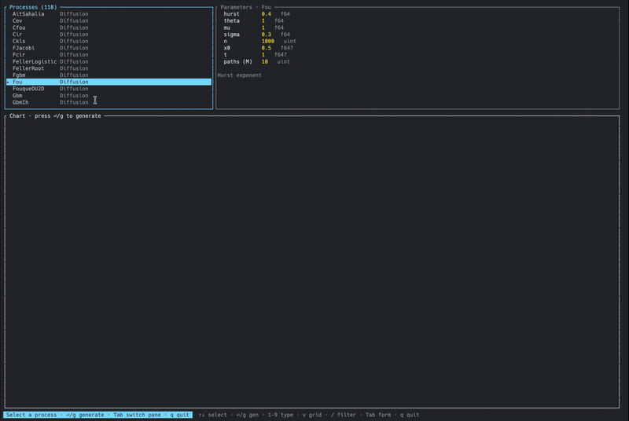

# ito

A terminal UI for exploring the [`stochastic-rs`](https://github.com/rust-dd/stochastic-rs)
process library. Pick any process by name, edit every parameter, generate `M`
Monte-Carlo paths, and plot them — all on the CPU, in `f64`.

## Demo



[▶ full-resolution mp4](assets/demo.mp4)

```
cargo run --release
```

## Keys

| Key | Action |
| --- | --- |
| `↑` / `↓` (or `j` / `k` in the list) | move selection / field |
| `Tab` | switch between the process list and the parameter form |
| `Enter` / `g` | generate paths |
| `1`–`9` (in the list) | switch the chart between path types — each state variable (asset / variance / …) on its own scale. The title shows the bound keys as `[1][2][3]…` and names the selected one |
| `v` (in the list) | toggle a grid of every path-type chart vs. the single paged view |
| `/` | filter the process list (Enter to apply, Esc to clear) |
| type / `Backspace` | edit the focused parameter (in the form) |
| `q` / `Ctrl-C` | quit |

Each parameter shows its type hint: `f64`, `uint`, `f64?`/`uint?`/`bool?`
(optional — type `none` to leave unset). `paths (M)` controls how many
independent trajectories are drawn.
